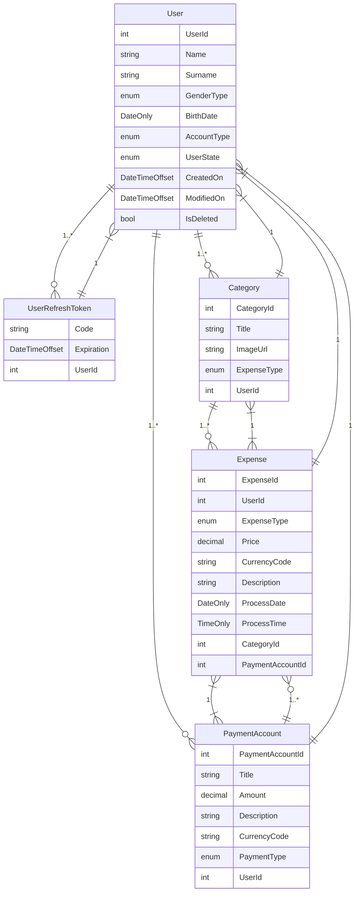

```mermaid

erDiagram
    User ||--o{ UserRefreshToken : "1..*"
    User ||--o{ Category : "1..*"
    User ||--o{ PaymentAccount : "1..*"
    UserRefreshToken ||--|{ User : "1"
    Category ||--o{ Expense : "1..*"
    Category ||--|{ User : "1"
    Expense }|--|{ Category : "1"
    Expense }|--|{ PaymentAccount : "1"
    Expense ||--|{ User : "1"
    PaymentAccount ||--o{ Expense : "1..*"
    PaymentAccount ||--|{ User : "1"

    User {
        int UserId
        string Name
        string Surname
        enum GenderType
        DateOnly BirthDate
        enum AccountType
        enum UserState
        DateTimeOffset CreatedOn
        DateTimeOffset ModifiedOn
        bool IsDeleted
    }
    UserRefreshToken {
        string Code
        DateTimeOffset Expiration
        int UserId
    }
    Category {
        int CategoryId
        string Title
        string ImageUrl
        enum ExpenseType
        int UserId
    }
    Expense {
        int ExpenseId
        int UserId
        enum ExpenseType
        decimal Price
        string CurrencyCode
        string Description
        DateOnly ProcessDate
        TimeOnly ProcessTime
        int CategoryId
        int PaymentAccountId
    }
    PaymentAccount {
        int PaymentAccountId
        string Title
        decimal Amount
        string Description
        string CurrencyCode
        enum PaymentType
        int UserId
    }
```